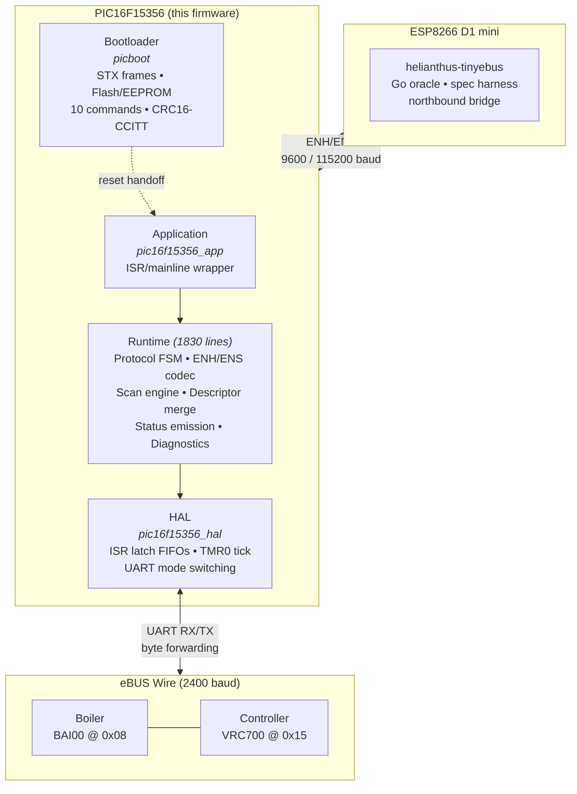

# helianthus-ebus-adapter-pic

**Deterministic PIC16F15356 firmware for the Helianthus eBUS adapter v3.x**

[]()
[](LICENSE)
[]()

---

## What This Is

This is a clean-room firmware implementation for the PIC16F15356 microcontroller used in eBUS adapter v3.x hardware. It implements the Enhanced (ENH) adapter protocol, providing a transparent UART bridge between an ESP host and the eBUS wire.

**This firmware was generated 100% by AI agents.** No line of code was written by a human. Every function, test, assertion, and comment was authored by AI agents (OpenAI Codex GPT-5.4 and Anthropic Claude Opus 4) operating under human architectural direction and adversarial review.

## Objectives

1. **Feature parity** with the original production adapter firmware (reverse-engineered via Ghidra decompilation of the legacy `combined.hex` image)
2. **Perfect determinism** — zero jitter, bounded latency, fully predictable execution on every code path
3. **Provable correctness** — 64 adversarial findings identified across 8 independent review agents, all resolved to convergence (0 CRITICAL, 0 HIGH, 0 MEDIUM)
4. **Oracle-validated** — C implementation cross-validated against a Go reference oracle (`helianthus-tinyebus`) for bit-exact parity
5. **Hardware-ready** — designed for XC8 compilation targeting real PIC16F15356 silicon

## Architecture



### Adapter Role

This firmware is a **transparent UART bridge**, not an eBUS node. All eBUS protocol responsibilities (CRC-8, frame escaping, arbitration decisions, retransmission) are delegated to the Go gateway running on the ESP host. The PIC handles:

- SYN byte detection and forwarding
- ENH/ENS encoding between PIC and host
- Bus byte forwarding with arbitration echo suppression
- Scan window management and descriptor processing
- Periodic status emission (snapshot + variant frames)

## Documentation

Detailed firmware documentation lives in [helianthus-docs-ebus](https://github.com/Project-Helianthus/helianthus-docs-ebus):

- [Firmware Overview](https://github.com/Project-Helianthus/helianthus-docs-ebus/blob/main/firmware/pic16f15356-overview.md) — architecture, protocol layers, memory map
- [State Machines](https://github.com/Project-Helianthus/helianthus-docs-ebus/blob/main/firmware/pic16f15356-fsm.md) — protocol FSM, scan phase FSM, ENH parser, startup states
- [Timing Model](https://github.com/Project-Helianthus/helianthus-docs-ebus/blob/main/firmware/pic16f15356-timing.md) — clock, TMR0, UART baud rates, scan deadlines
- [Register Configuration](https://github.com/Project-Helianthus/helianthus-docs-ebus/blob/main/firmware/pic16f15356-registers.md) — oscillator, timer, EUSART, interrupt, descriptor addresses

Protocol specifications:
- [ENH Protocol](https://github.com/Project-Helianthus/helianthus-docs-ebus/blob/main/protocols/enh.md) — enhanced adapter protocol encoding
- [ENS Protocol](https://github.com/Project-Helianthus/helianthus-docs-ebus/blob/main/protocols/ens.md) — serial speed variant

## Recovered Hardware Model

From reverse-engineering of the original `combined.hex` (Ghidra decompilation, 76 functions, 10K lines):

| Parameter | Value | Source |
|-----------|-------|--------|
| MCU | PIC16F15356 | Datasheet |
| Flash | 16KB (0x4000 words) | Datasheet |
| RAM | 2KB (2048 bytes) | Datasheet |
| Reset clock | HFINTOSC 1 MHz | CONFIG1 word 0x3FEC |
| Runtime clock | HFINTOSC 32 MHz | OSCCON1=0x60, OSCFRQ=0x06 |
| TMR0 ISR | ~500 microseconds | T0CON1=0x44, TMR0H=0xF9 |
| Scheduler tick | ~100 ms | Software divider of 200 |
| Default UART | ~9600 baud | SPBRG=0x0340 |
| High-speed UART | ~115200 baud | SPBRG=0x0044 |
| Bootloader slow | 115200 baud | Host-side contract |
| Bootloader fast | 921600 baud | Host-side contract |

## Determinism Enforcement

Every commit is gated by automated determinism checks. See [DETERMINISM.md](DETERMINISM.md) for full rules.

| Rule | Check | Status |
|------|-------|--------|
| R1: No recursion | `make check-recursion` | Enforced |
| R2: No dynamic allocation | `make check-malloc` | Enforced |
| R3: All loops bounded | `make check-loops` | Enforced |
| R6: No floating point | `make check-float` | Enforced |
| R8: Complexity bounded | `make check-complexity` | Enforced |
| R4: ISR constraints | Future (XC8 target) | Planned |
| R5: No blocking delays | Future (XC8 target) | Planned |
| R9: Hardware timers | Code review | Manual |
| R10: Power-of-two buffers | Code review | Manual |

```bash
# Run all determinism checks
make check-all

# Run full test suite + oracle parity
make test && make oracle-check
```

## Adversarial Validation

The codebase underwent 2 rounds of adversarial analysis by 11 independent AI agents attacking from:

- **C11 undefined behavior** — shifts, overflow, null deref, buffer bounds
- **Silent failure paths** — ignored returns, lost data, masked errors
- **Determinism violations** — non-deterministic paths, uninitialized state
- **Type design** — invariant enforcement, dead code, naming
- **ENH protocol compliance** — encoding, session management, error codes
- **eBUS wire protocol** — arbitration, timing, layer separation
- **Scan FSM behavioral parity** — mathematical correctness vs decompiled original

**Result: 64 findings identified, 64 fixed, converged to 0/0/0 (CRITICAL/HIGH/MEDIUM).**

## Build & Test

```bash
# Prerequisites: C11 compiler (clang or gcc), Python 3
# No XC8 needed for host-side validation

# Build and run all tests
make test

# Run oracle parity check (C vs Go)
make oracle-check

# Run determinism enforcement
make check-all

# Run check script self-tests
bash tests/test_checks.sh

# Clean build
make clean
```

## Metrics

| Component | Lines |
|-----------|-------|
| `runtime/src/runtime.c` | 1,830 |
| `tests/test_runtime.c` | 2,684 |
| `bootloader/src/picboot.c` | 833 |
| `tools/picfw_oracle_check.c` | 1,412 |
| Total codebase | ~7,700 |
| Test suites | 32+ |
| Adversarial findings resolved | 64/64 |

## Project Structure

```
helianthus-ebus-adapter-pic/
├── LICENSE                     AGPLv3
├── README.md                   This file
├── DETERMINISM.md              Determinism rules and rationale
├── CONTRIBUTORS.md             Development history and contribution model
├── Makefile                    Build + checks + tests
├── runtime/
│   ├── include/picfw/          Headers: runtime, codecs, HAL, platform model
│   └── src/                    Implementation: runtime, codecs, HAL, info
├── bootloader/
│   ├── include/picboot/        Bootloader protocol header
│   └── src/                    Bootloader implementation
├── tests/
│   ├── test_runtime.c          Runtime test suite (32+ tests)
│   ├── test_adapter_protocol.c Protocol codec tests
│   ├── test_checks.sh          Determinism check self-tests
│   └── fixtures/               Bad example code for check validation
├── tools/
│   ├── picfw_oracle_check.c    Runtime oracle (C vs Go parity)
│   └── picboot_oracle_check.c  Bootloader oracle
├── scripts/
│   ├── check_no_recursion.py   R1 enforcement
│   ├── check_no_malloc.py      R2/R7 enforcement
│   ├── check_bounded_loops.py  R3 enforcement
│   ├── check_no_float.py       R6 enforcement
│   ├── check_complexity.py     R8 enforcement
│   ├── check_isr_constraints.py R4 (future)
│   ├── check_no_delay_critical.py R5 (future)
│   ├── wcet_estimate.py        WCET estimation (future)
│   └── *.sh                    Oracle check scripts
├── hooks/
│   └── pre-commit              Git pre-commit hook
└── .github/
    └── workflows/              CI: determinism check + build
```

## License

GNU Affero General Public License v3.0 or later. See [LICENSE](LICENSE).

## Related Repositories

- [helianthus-tinyebus](https://github.com/Project-Helianthus/helianthus-tinyebus) — Go oracle, ESP8266 bridge, adapter protocol reference
- [helianthus-ebusgateway](https://github.com/Project-Helianthus/helianthus-ebusgateway) — Go eBUS gateway (semantic layer, GraphQL, MCP)
- [helianthus-ha-integration](https://github.com/Project-Helianthus/helianthus-ha-integration) — Home Assistant custom integration
