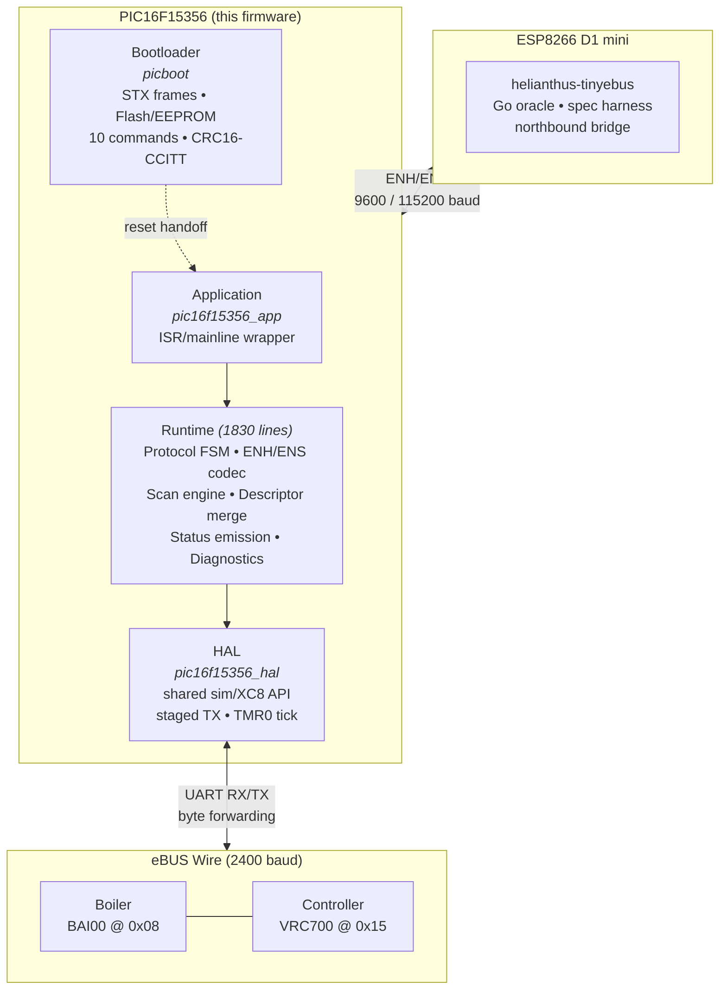

# helianthus-ebus-adapter-pic

**Deterministic PIC16F15356 firmware for the Helianthus eBUS adapter v3.x**

[]()
[](LICENSE)
[]()

---

## What This Is

This repository contains a clean-room, host-buildable firmware tree for the PIC16F15356 used in eBUS adapter v3.x hardware. It includes:

- a deterministic runtime scaffold for the northbound adapter protocol
- a split PIC16F15356 HAL under one public API:
  simulation profile for host/oracle work and silicon profile for XC8 bring-up
- a staged host TX path where mainline fills a bounded queue and TX-ready
  service exposes one transmitted byte at a time
- a canonical provisioning normalization path from legacy `WRITE_CONFIG`
- a split bootloader engine: host-side memory model plus target-facing backend profile
- a Go oracle parity harness in `helianthus-tinyebus`

It does **not** yet prove first-power-on success on real PIC silicon. XC8-backed NVM register access, W5500/SPI, DHCP, and several provisioning paths remain simulation models or target-facing scaffolds.

## Objectives

1. Reconstruct the documented northbound PIC contract without inheriting historical bugs.
2. Keep runtime execution bounded and analyzable in a host-buildable C codebase.
3. Cross-check wire-visible behavior against a Go oracle (`helianthus-tinyebus`).
4. Make hardware gaps explicit instead of pretending silicon parity where it does not yet exist.

## Architecture


```mermaid
graph TD
    subgraph PIC16F15356["PIC16F15356 (this firmware)"]
        APP["Application<br/><i>pic16f15356_app</i><br/>ISR/mainline wrapper"]
        RT["Runtime <i>(1830 lines)</i><br/>Protocol FSM &bull; ENH/ENS codec<br/>Scan engine &bull; Descriptor merge<br/>Status emission &bull; Diagnostics"]
        HAL["HAL<br/><i>pic16f15356_hal</i><br/>shared sim/XC8 API<br/>staged TX &bull; TMR0 tick"]
        BOOT["Bootloader<br/><i>picboot</i><br/>STX frames &bull; Flash/EEPROM<br/>10 commands &bull; CRC16-CCITT"]
        APP --> RT
        RT --> HAL
        BOOT -.->|reset handoff| APP
    end

    subgraph ESP["ESP8266 D1 mini"]
        TINY["helianthus-tinyebus<br/>Go oracle &bull; spec harness<br/>northbound bridge"]
    end

    subgraph BUS["eBUS Wire (2400 baud)"]
        BOILER["Boiler<br/>BAI00 @ 0x08"]
        VRC["Controller<br/>VRC700 @ 0x15"]
    end

    ESP <-->|"ENH/ENS<br/>9600 / 115200 baud"| PIC16F15356
    HAL <-->|"UART RX/TX<br/>byte forwarding"| BUS
    BOILER --- VRC
```

### Adapter Role

This firmware is not an eBUS application node. The current tree models the adapter endpoint and hardware bring-up surfaces while keeping the higher-level eBUS semantics in host software. The PIC-side code currently handles or models:

- SYN byte detection and forwarding
- ENH/ENS encoding between PIC and host
- ENH request/response handling
- scan/status state scaffolding
- strap decode, LED state, coarse timing, host/bus UART role separation,
  and staged host TX pacing
- bootloader framing plus backend-split storage/reset engine
- runtime normalization from loader-canonical provisioning bytes

The following areas are still scaffolded or synthetic:

- XC8-backed flash/EEPROM/config register access behind the target bootloader profile
- silicon HAL register binding beyond compile-only register mirrors
- descriptor acquisition from the live bus
- W5500/SPI and DHCP
- exact provision-from-loader parity on first power-up

### HAL Profiles and TX Semantics

`pic16f15356_hal.h` stays the public HAL interface for both build profiles:

- `PICFW_HAL_PROFILE_SIM`: host tests and oracle runs
- `PICFW_HAL_PROFILE_XC8`: silicon-oriented compile/bind path

The host TX path is now explicitly split inside the HAL:

- `host_tx_stage`: bounded queue filled by mainline after `runtime_step()`
- simulation outbox: bytes already transmitted by TX-ready service

`hal_drain_host_tx()` / `app_drain_host_tx()` therefore mean:

- on simulation builds: drain only bytes that have actually been transmitted
- on silicon builds: return `0`, because no simulation outbox exists

Staged bytes are never exposed as transmitted until a TX-ready event consumes
exactly one byte from the stage queue.

### Provisioning Source of Truth

Provisioning remains loader-canonical. The firmware now treats the legacy
`ebuspicloader` config windows as the persisted source of truth and normalizes
them into runtime state during boot:

- settings window `0x0000..0x0007`
- MUI window `0x0106..0x010D`
- derived runtime cache for IP, MAC, arbitration delay, and variant policy

The runtime cache is explicitly derivative. It is not a second canonical
configuration format.

## Documentation

Detailed firmware documentation lives in [helianthus-docs-ebus](https://github.com/Project-Helianthus/helianthus-docs-ebus):

- [Firmware Overview](https://github.com/Project-Helianthus/helianthus-docs-ebus/blob/main/firmware/pic16f15356-overview.md) — architecture, protocol layers, memory map
- [State Machines](https://github.com/Project-Helianthus/helianthus-docs-ebus/blob/main/firmware/pic16f15356-fsm.md) — protocol FSM, scan phase FSM, ENH parser, startup states
- [Timing Model](https://github.com/Project-Helianthus/helianthus-docs-ebus/blob/main/firmware/pic16f15356-timing.md) — clock, TMR0, UART baud rates, scan deadlines
- [Register Configuration](https://github.com/Project-Helianthus/helianthus-docs-ebus/blob/main/firmware/pic16f15356-registers.md) — oscillator, timer, EUSART, interrupt, descriptor addresses

Protocol specifications:
- [ENH Protocol](https://github.com/Project-Helianthus/helianthus-docs-ebus/blob/main/protocols/enh.md) — enhanced adapter protocol encoding
- [ENS Protocol](https://github.com/Project-Helianthus/helianthus-docs-ebus/blob/main/protocols/ens.md) — serial speed variant

## Recovered Hardware Model

From reverse-engineering of the original `combined.hex` (Ghidra decompilation, 76 functions, 10K lines):

| Parameter | Value | Source |
|-----------|-------|--------|
| MCU | PIC16F15356 | Datasheet |
| Flash | 16KB (0x4000 words) | Datasheet |
| RAM | 2KB (2048 bytes) | Datasheet |
| Reset clock | HFINTOSC 1 MHz | CONFIG1 word 0x3FEC |
| Runtime clock | HFINTOSC 32 MHz | OSCCON1=0x60, OSCFRQ=0x06 |
| TMR0 ISR | ~500 microseconds | T0CON1=0x44, TMR0H=0xF9 |
| Scheduler tick | ~100 ms | Software divider of 200 |
| Bus UART model | ~2400 baud | EUSART1 SPBRG=0x0D04 |
| Host UART default | ~9600 baud | EUSART2 SPBRG=0x0340 |
| Host UART high-speed | ~115200 baud | EUSART2 SPBRG=0x0044 |
| Bootloader slow | 115200 baud | Host-side contract |
| Bootloader fast | 921600 baud | Host-side contract only; not implemented as a PIC boot path in this tree |

## Bootloader Profiles

The bootloader code now has two explicit profiles under the same frame/parser
engine:

- `picboot_bootloader_t`: host validation model with flash/EEPROM/config RAM mirrors
- `picboot_target_t`: target-facing profile that delegates flash/EEPROM/config
  access and reset handoff through backend callbacks

This split is meant to let XC8/silicon builds bind real NVM register access
without dragging the 33KB host model into PIC RAM.

## Determinism Enforcement

Every commit is gated by automated determinism checks. See [DETERMINISM.md](DETERMINISM.md) for full rules.

| Rule | Check | Status |
|------|-------|--------|
| R1: No recursion | `make check-recursion` | Enforced |
| R2: No dynamic allocation | `make check-malloc` | Enforced |
| R3: All loops bounded | `make check-loops` | Enforced |
| R6: No floating point | `make check-float` | Enforced |
| R8: Complexity bounded | `make check-complexity` | Enforced |
| R4: ISR constraints | Optional XC8-oriented target | Available, not part of `check-all` |
| R5: No blocking delays | Optional XC8-oriented target | Available, not part of `check-all` |
| R9: Hardware timers | Code review | Manual |
| R10: Power-of-two buffers | Code review | Manual |

```bash
# Run all determinism checks
make check-all

# Compile the silicon HAL profile with the host compiler
make check-xc8-compile

# Run full test suite + oracle parity
make test && make oracle-check
```

## Adversarial Validation

The codebase is reviewed adversarially from multiple angles, especially around:

- **C11 undefined behavior** — shifts, overflow, null deref, buffer bounds
- **Silent failure paths** — ignored returns, lost data, masked errors
- **Determinism violations** — non-deterministic paths, uninitialized state
- **Type design** — invariant enforcement, dead code, naming
- **ENH protocol compliance** — encoding, session management, error codes
- **eBUS wire protocol** — arbitration, timing, layer separation
- **Scan FSM behavioral parity** — mathematical correctness vs decompiled original

The repo should be treated as a deterministic scaffold under active review, not as evidence that all production risks are closed.

## Build & Test

```bash
# Prerequisites: C11 compiler (clang or gcc), Python 3
# No XC8 needed for host-side validation

# Build and run all tests
make test

# Run oracle parity check (C vs Go)
make oracle-check

# Run determinism enforcement
make check-all

# Compile-only check for the XC8-oriented HAL profile
make check-xc8-compile

# Run check script self-tests
bash tests/test_checks.sh

# Clean build
make clean
```

## Metrics

| Component | Lines |
|-----------|-------|
| `runtime/src/runtime.c` | see local checkout |
| `tests/test_runtime.c` | see local checkout |
| `bootloader/src/picboot.c` | see local checkout |
| `tools/picfw_oracle_check.c` | see local checkout |
| Static RAM footprint | `make check-all` |
| Test suites | host-side only |

## Project Structure

```
helianthus-ebus-adapter-pic/
├── LICENSE                     AGPLv3
├── README.md                   This file
├── DETERMINISM.md              Determinism rules and rationale
├── CONTRIBUTORS.md             Development history and contribution model
├── Makefile                    Build + checks + tests
├── runtime/
│   ├── include/picfw/          Headers: runtime, codecs, HAL, platform model
│   └── src/                    Implementation: runtime, codecs, HAL, info
├── bootloader/
│   ├── include/picboot/        Bootloader protocol header
│   └── src/                    Bootloader implementation
├── tests/
│   ├── test_runtime.c          Runtime test suite (32+ tests)
│   ├── test_adapter_protocol.c Protocol codec tests
│   ├── test_checks.sh          Determinism check self-tests
│   └── fixtures/               Bad example code for check validation
├── tools/
│   ├── picfw_oracle_check.c    Runtime oracle (C vs Go parity)
│   └── picboot_oracle_check.c  Bootloader oracle
├── scripts/
│   ├── check_no_recursion.py   R1 enforcement
│   ├── check_no_malloc.py      R2/R7 enforcement
│   ├── check_bounded_loops.py  R3 enforcement
│   ├── check_no_float.py       R6 enforcement
│   ├── check_complexity.py     R8 enforcement
│   ├── check_isr_constraints.py R4 (future)
│   ├── check_no_delay_critical.py R5 (future)
│   ├── wcet_estimate.py        WCET estimation (future)
│   └── *.sh                    Oracle check scripts
├── hooks/
│   └── pre-commit              Git pre-commit hook
└── .github/
    └── workflows/              CI: determinism check + build
```

## License

GNU Affero General Public License v3.0 or later. See [LICENSE](LICENSE).

## Related Repositories

- [helianthus-tinyebus](https://github.com/Project-Helianthus/helianthus-tinyebus) — Go oracle, ESP8266 bridge, adapter protocol reference
- [helianthus-ebusgateway](https://github.com/Project-Helianthus/helianthus-ebusgateway) — Go eBUS gateway (semantic layer, GraphQL, MCP)
- [helianthus-ha-integration](https://github.com/Project-Helianthus/helianthus-ha-integration) — Home Assistant custom integration
